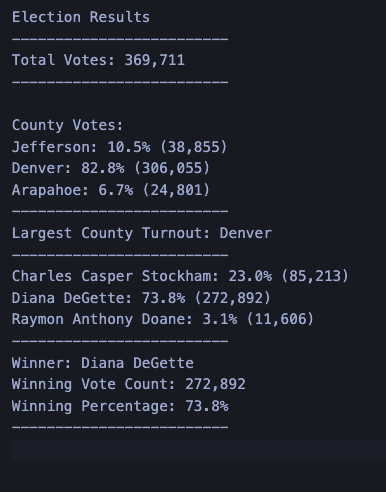

# Election Analysis

## Project Overview
Tom, a Colorado Board of Elections employee has given me the following tasks to complete the election audit of a recent local congressional election using Python:

1. Calculate the total number of votes cast 
2. Generate a complete list of candidates who received votes
3. Calculate the total number of votes each candidate receieved
4. Calculate the percentage of votes each candidate won
5. Determine the winner of the election based on popular vote

## Resources
- Data source: election_results.csv
- Software: Python 3.8.5, Visual Studio Code

## Summary
The election analysis shows that:
- There were 369,711 votes casted in the election 
- The candidates were:
  -  Charles Casper Stockham
  -  Diana DeGette
  -  Raymon Anthony Doane
- The candidate results were:
  - Charles Casper Stockham: 23.0% (85,213)
  - Diana DeGette: 73.8% (272,892)
  - Raymon Anthony Doane: 3.1% (11,606)
- The winner of the election was:
  - Diana DeGette, who received 73.8% of the vote and 272,892 votes. 

## Challenge Overview

### Overview of the Analysis

#### Purpose

The purpose of this election audit analysis is to provide the election commission with additional information about county turnout and voting percentages. These data can help the commission understand voting patterns and prepare for more significant elections.   

The below data was collected in this additional analysis to complete the election audit:
- name of each county and each county's voter turnout
- the percentage of votes from each county out of the total count 
- the county with the highest turnout

The following report will outline the significant outcomes from the election audit analysis and provide examples of how the election commission can modify the script for other elections. 

### Election Audit Results

#### Snapshot of Text File 

#### Results
The updated election analysis shows that:
- A total of 369,711 votes were cast in this congressional election
- Votes were cast from 3 counties:
  -  Jefferson
  - Denver
  - Arapahoe
- The county results were:
  - Jefferson: 10.5% (38,855)
  - Denver: 82.8% (306,055)
  - Arapahoe: 6.7% (24,801)
- Denver had the largest number of votes out of all counties, which cast 82.8% of the vote and 306,055 votes
- The candidate results were:
  - Charles Casper Stockham: 23.0% (85,213)
  - Diana DeGette: 73.8% (272,892)
  - Raymon Anthony Doane: 3.1% (11,606)
- The winner of the election was:
  - Diana DeGette, who received 73.8% of the vote and 272,892 votes

## Challenge Summary

This election audit analysis is an excellent example of how the election commission can use a simple script to perform significant analyses. 

The election commission can modify this script for any election:
- by creating different text files for each district 
- by including more information in the print statements specific to each district or each election (e.g. analysis of the losing candidates) 

